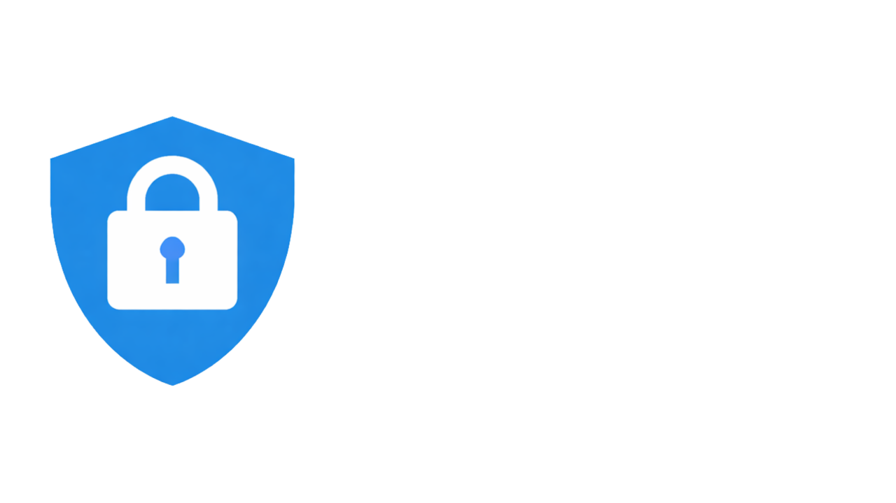
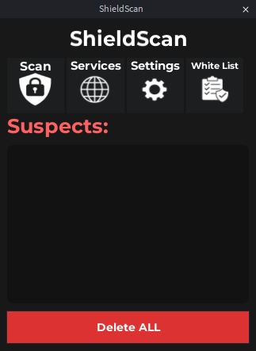

<h1 align="center">Shield Scan</h1> 

## What it Shield Scan?
Shield Scan is an **anti-backdoor plugin for Roblox Studio** designed to help developers detect
suspicious scripts commonly found in free models and imported assets.

The plugin scans selected services or the entire game and highlights scripts that match known
backdoor patterns.

> ⚠️ Shield Scan uses heuristic pattern detection.  
> Flagged scripts are **not automatically malicious** and should always be reviewed manually.

---

## Features

- Scan specific services or the entire game
- Detect common backdoor patterns (e.g. `require(assetId)`, `HttpGet`, loaders)
- Highlights suspicious scripts inside Studio
- One-click removal of detected scripts
- Clean and minimal plugin UI
- Open-source and auditable

---

## Installation

### Option 1 – Roblox Creator Store
Install Shield Scan directly from the Roblox Creator Store. You can find it [here](https://create.roblox.com/store/asset/118988717840663/ShieldScan)

- Automatic updates
- Easy installation
- Supports development

### Option 2 – From Source
To install Shield Scan locally, go to the Releases section of this repository and download the .rbxmx file.

Then:
1. Open Studio
2. Click the plugins tab
3. Click Plugins Folder on the left
4. Drag the downloaded .rbxmx file into the folder
5. Restart Roblox Studio

On Studio starts, the plugin will be available
> Installing from source is intended for **code inspection and development only**.

---

## How It Works

Shield Scan scans script sources using pattern matching to identify:
- Remote code loaders
- Asset-based execution
- Suspicious networking calls
- Obfuscated or hidden execution patterns

This approach helps detect **common threats**, but does not guarantee 100% detection.

---

## Open Source & Usage

The source code is publicly available to ensure transparency.

You are allowed to:
- Install and use the plugin
- Inspect and study the source code
- Modify the code for personal use

You are **not allowed** to:
- Reupload or redistribute the plugin
- Publish modified versions as your own plugin
- Sell copies of the plugin

See the `LICENSE` file for details.

---

## UI

---

## Disclaimer

Shield Scan is a **security assistance tool**, not a replacement for manual review.
Always verify scripts before deleting them from your project.

---

## Feedback

Feedback and suggestions are very welcome.
If you encounter bugs, false positives, missing detections, UI or usability issues and features ideas, feel free to open an Issue on this repository or share feedback on the DevForum thread.
> The goal is to make Shield Scan safer and more reliable with each update.

---

## 📄 License

This project is licensed under a custom license.
See the `LICENSE` file for more information.
